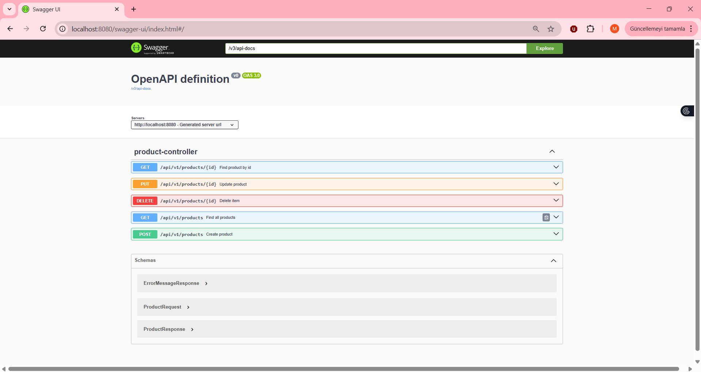
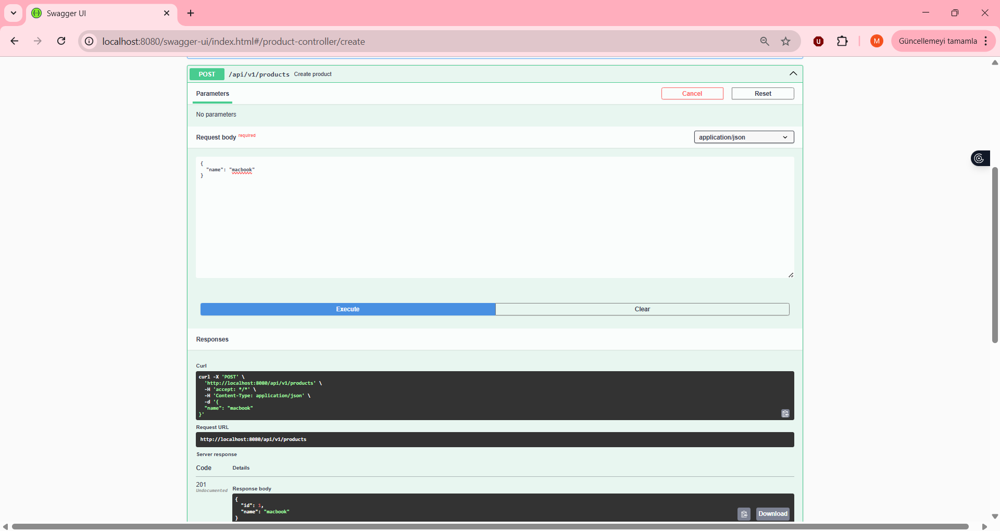
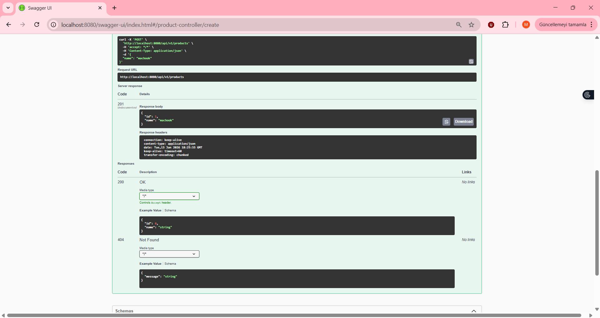
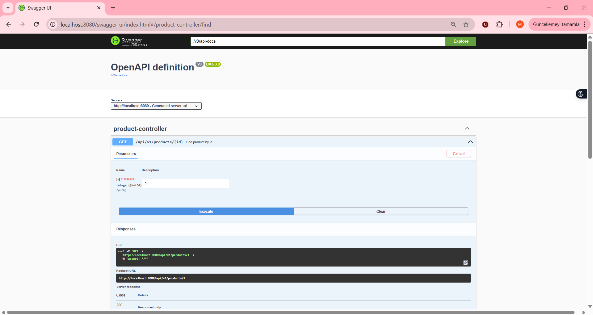
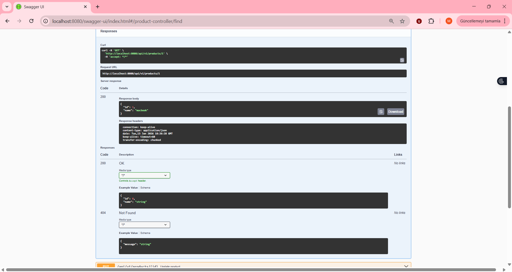
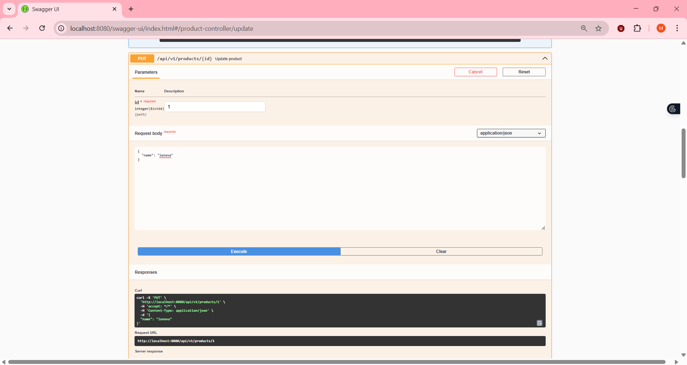
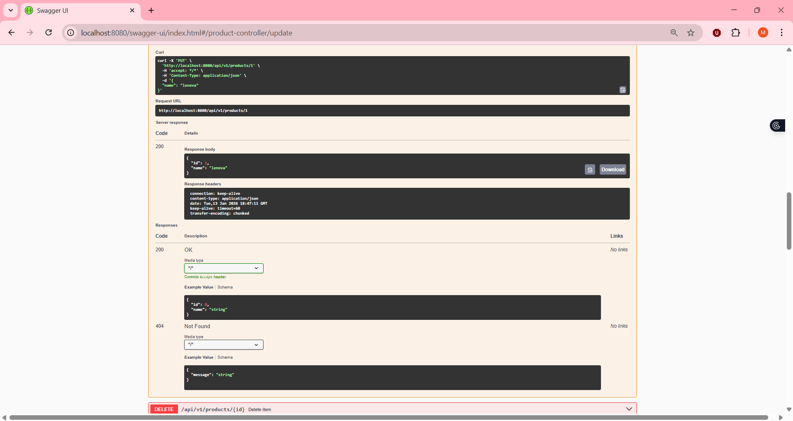
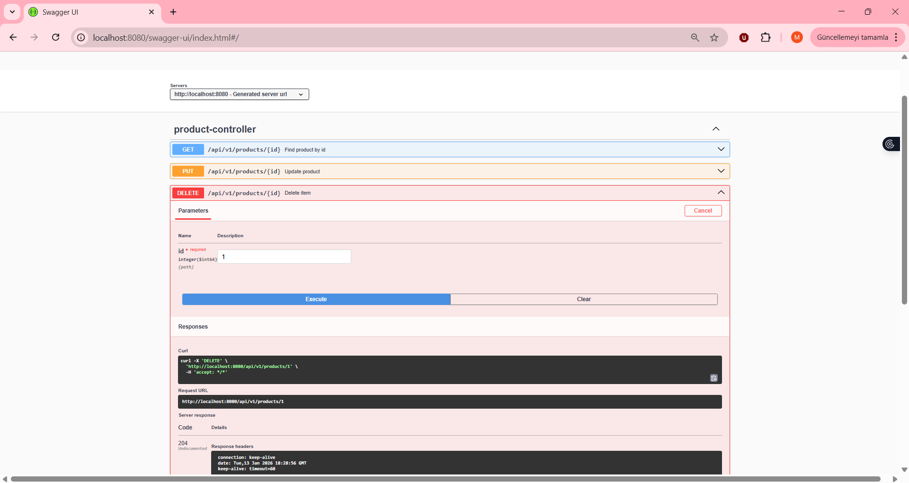
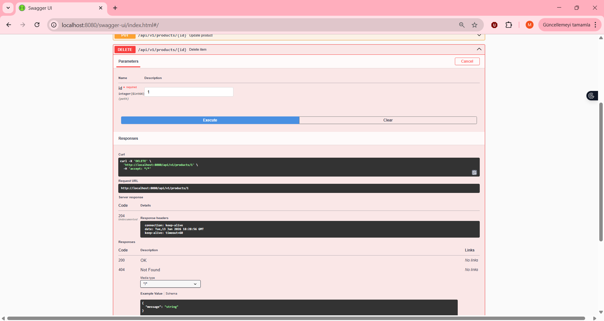

# First REST API Spring (Task 2)

This is a backend-only application developed for the **Spring Framework Apps** course. It implements a fully functional REST API for managing products using **Spring Boot**, **Spring Data JPA**, and **H2 Database**.

## 🏗 Project Architecture

The project follows a layered architecture to ensure separation of concerns:

* **`api` (Controller):** Handles HTTP requests (GET, POST, PUT, DELETE) and maps JSON to DTOs.
* **`service`:** Contains business logic.
* **`repository`:** Interacts with the H2 Database using `JpaRepository`.
* **`domain`:** Defines the `Product` entity.
* **`support/exception`:** Handles global exceptions (e.g., `ProductNotFoundException`) using `@ControllerAdvice`.

## 🛠 Technologies

* **Spring Web:** RESTful services
* **Spring Data JPA:** Database abstraction
* **H2 Database:** In-memory database for rapid development
* **Swagger UI (OpenAPI):** API documentation and testing interface
* **Lombok:** Boilerplate code reduction

## 🧪 API Documentation & Usage Scenarios

The API is documented using **Swagger UI**. Below are tested use cases demonstrating **CRUD operations** and **Error Handling**.

---

### 1. API Dashboard

Overview of all available endpoints for the Product Controller.



---

### 2. Create Product (POST)

**Endpoint:** `/api/v1/products`

Creating a new product named **macbook**. The server returns **201 Created**.

**Request:**



**Response:**



---

### 3. Read Product (GET)

**Endpoint:** `/api/v1/products/{id}`

Fetching the product with ID `1`. The server returns **200 OK**.

**Request:**



**Response:**



---

### 4. Update Product (PUT)

**Endpoint:** `/api/v1/products/{id}`

Updating an existing product. The server returns the updated object.

**Request:**



**Response:**



---

### 5. Error Handling & Delete (DELETE)

**Endpoint:** `/api/v1/products/{id}`

Demonstration of the custom **Exception Handler**. When trying to access or delete a non-existent product, the API returns a meaningful **404 Not Found** JSON response instead of a generic 500 error.

**Scenario: Product with ID 1 not found**





---

## ▶️ How to Run

1. Clone the repository.
2. Run the application:

   ```bash
   mvn spring-boot:run
   ```
3. Access Swagger UI:

   ```
   http://localhost:8080/swagger-ui/index.html
   ```
4. Access H2 Console:

   ```
   http://localhost:8080/console
   ```
**Author:** Miray Büyüktepe
 
